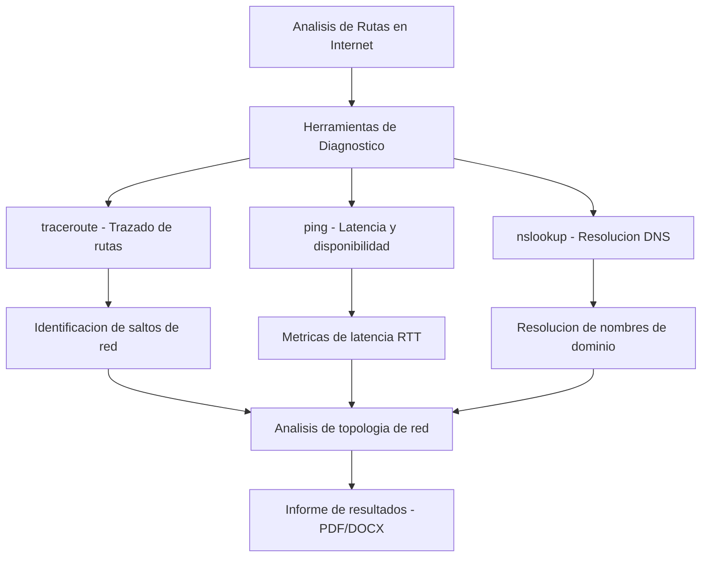

# Análisis de Rutas sobre Internet

> Diagnóstico de rutas de Internet con traceroute: análisis de latencia, saltos TTL y topología BGP.

## Descripción

---

Análisis de rutas de red sobre Internet empleando herramientas de trazado de ruta (`traceroute`/`tracert`): identificación de saltos TTL, medición de latencia por segmento, detección de cuellos de botella y estudio de las rutas BGP que siguen los paquetes entre diferentes sistemas autónomos (AS).

## Contenido del repositorio

| Archivo | Descripción |
|---|---|
| `*.pdf` | Informe de análisis de rutas con capturas y tablas |
| `Tablas.xlsx` | Datos de latencia, TTL y rutas registradas |
| `*.docx` | Desarrollo del laboratorio |

## Arquitectura

## Metodología aplicada

1. Ejecución de `traceroute` hacia destinos nacionales e internacionales
2. Registro de saltos, RTT (Round-Trip Time) y AS intermedios
3. Análisis de la topología de rutas y detección de anomalías
4. Comparativa de rutas desde distintos orígenes

## Contexto académico

**Asignatura:** Redes de Computadores · **Institución:** Ingeniería Informática
**Autor:** Alejandro De Mendoza — Ingeniero Informático · Máster Arquitectura de Software

---

## Autor

**Alejandro De Mendoza**  
Ingeniero Informático · Especialista en IA · Especialista en Ingeniería de Software · Máster en Arquitectura de Software

